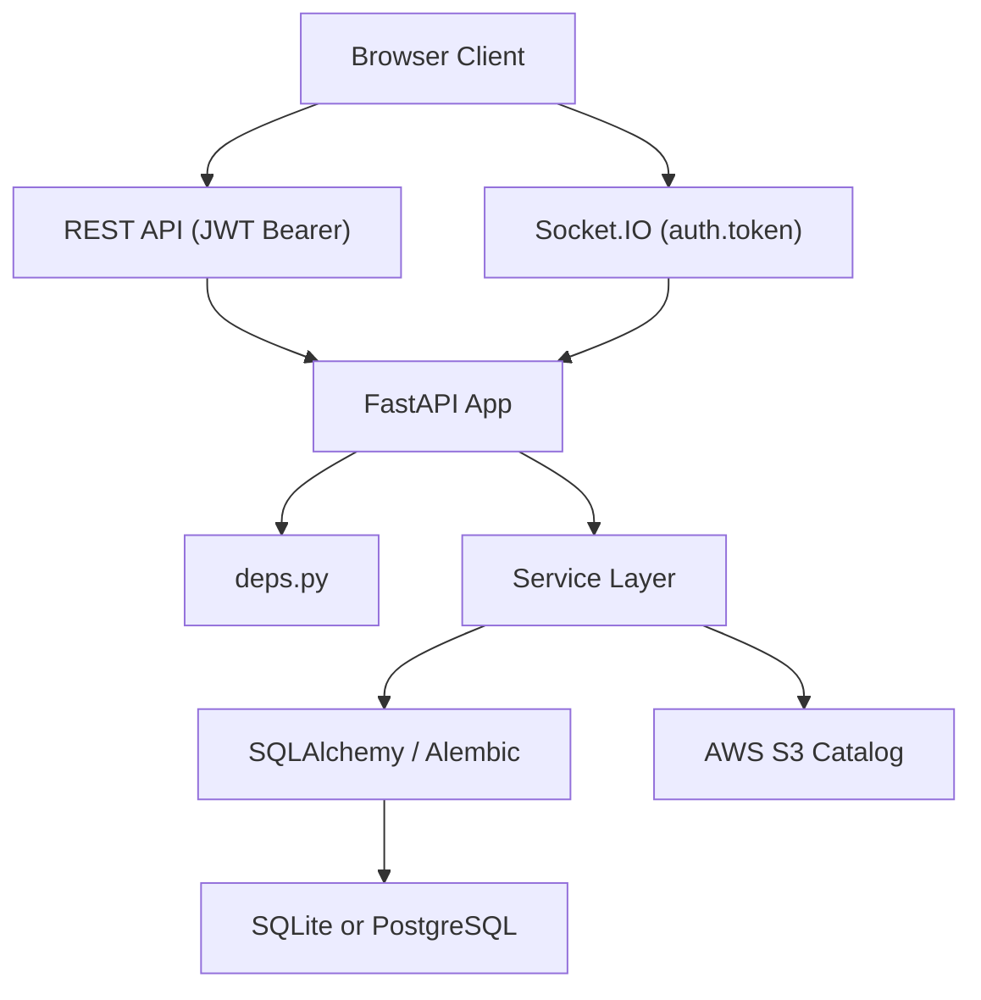

# 백엔드 구조 상세 가이드

## 아키텍처 개요

백엔드는 FastAPI REST API와 Socket.IO 협업 서버를 함께 제공하며, 서비스 레이어를 통해 라우터와 비즈니스 로직을 분리합니다.



```text
Client
  ├─ REST API (JWT Bearer)
  └─ Socket.IO (auth.token 기반 JWT)
        ↓
FastAPI / Socket.IO
        ↓
Services
  ├─ UserService
  ├─ ProjectService
  ├─ LayoutService
  └─ FileService
        ↓
SQLAlchemy / Alembic
        ↓
SQLite 또는 PostgreSQL
```

## 핵심 디렉터리

```text
backend/
├── app/
│   ├── api/v1/          # REST / Socket.IO 엔드포인트
│   ├── services/        # 비즈니스 로직
│   ├── models/          # SQLAlchemy 모델
│   ├── schemas/         # Pydantic 스키마
│   ├── core/            # security, logging, collision, exceptions
│   ├── utils/           # 파일/GLB/PLY 유틸리티
│   ├── config.py        # 환경 변수 파싱
│   ├── database.py      # 엔진, 세션, DB 정보
│   └── main.py          # 앱 생성, lifespan, 라우터 등록
├── alembic/             # 마이그레이션
├── tests/               # pytest 테스트
└── requirements.txt
```

## 주요 모듈

### `app/api/deps.py`

- JWT 토큰을 사용자로 해석
- 일반 사용자 / 관리자 사용자 의존성 제공
- 관리자 기능은 `ADMIN_EMAILS` allowlist 기준

### `app/api/v1/catalog.py`

- 읽기 API: 일반 인증 사용자 접근 가능
- 쓰기/동기화 API: 관리자만 접근 가능
- S3 카탈로그 동기화, presigned URL 생성

### `app/api/v1/websocket.py`

- Socket.IO connect 시 `auth.token` 검증
- `join_project` 시 프로젝트 접근 권한 검증
- 클라이언트가 보내는 `user_id`를 신뢰하지 않음
- 잠금 owner와 presence는 인증된 사용자 기준으로만 처리

### `app/services/file_service.py`

- GLB / PLY 업로드 처리
- 스트리밍 업로드와 크기 제한
- 내부 `file_path`는 DB에만 저장
- 외부 응답에는 `download_url`만 제공

### `app/main.py`

- 앱 lifespan에서 테이블 생성, 로그 초기화
- `ENABLE_CATALOG_SYNC_ON_STARTUP`로 시작 시 S3 sync 제어
- 글로벌 예외 핸들러 등록

## 데이터 모델 요약

### `User`

- 이메일, 해시 비밀번호, 활성 상태

### `Project`

- 방 크기, 공유 여부, `build_mode`, `room_structure`
- 업로드 파일 메타데이터는 내부적으로 저장
- 외부 응답은 `download_url`만 노출

### `Layout`

- 버전별 `furniture_state`
- 현재 레이아웃 플래그

### `CatalogItem`

- 가구 메타데이터
- S3 `glb_key`

## 보안 경계

- REST API: `Authorization: Bearer <token>`
- Socket.IO: 연결 시 `auth.token`
- 카탈로그 쓰기/동기화: `ADMIN_EMAILS`
- 업로드 파일: `/downloads` 계열 보호 엔드포인트만 사용
- Nginx는 `/uploads/`를 직접 공개하지 않는 전제

## 로컬 실행 메모

- 기본 backend 포트: `8008`
- 테스트에서는 `ENABLE_CATALOG_SYNC_ON_STARTUP=false`로 S3 sync를 끄는 것이 안전
- 로컬 DB는 SQLite 가능, 권장 개발 경로는 PostgreSQL (`docker-compose.yml`)
- 제출/면접용 의사결정 요약은 [docs/09_기술_의사결정.md](/Users/kapr/Projects/External/Codyssey/term_project/furniture-platform/docs/09_기술_의사결정.md)를 우선 참고합니다.
