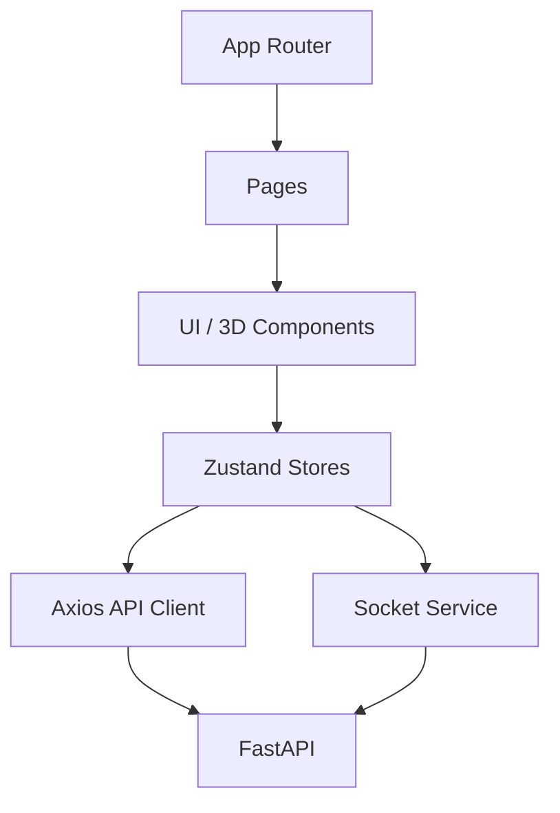

# 프론트엔드 구조 상세 가이드

## 아키텍처 개요

프론트엔드는 Next.js 15 App Router 기반이며, 상태 관리는 Zustand, 3D 렌더링은 React Three Fiber, 실시간 동기화는 Socket.IO Client로 구성됩니다.



```text
UI / App Router
   ↓
Components
   ↓
Zustand Stores
   ├─ authStore
   ├─ editorStore
   ├─ measureStore
   ├─ lightingStore
   └─ uiStore
   ↓
API Client / SocketService
   ↓
Backend REST / Socket.IO
```

## 핵심 디렉터리

```text
frontend/
├── app/                    # 라우트 페이지
├── components/             # 3D, editor, room-builder, ui
├── hooks/                  # useSocket, useAutoSave, useKeyboard
├── lib/                    # api client, socket, authToken, logger
├── store/                  # Zustand 스토어
├── types/                  # API / furniture / catalog / freeBuild 타입
└── public/                 # 이미지/템플릿 자산
```

## 인증과 토큰 저장

- 로그인 성공 시 JWT는 `sessionStorage`에 저장
- 과거 `localStorage` 토큰이 있으면 자동 마이그레이션
- API 요청은 Axios interceptor가 토큰을 자동 주입
- Socket.IO 연결도 같은 토큰을 `auth.token`으로 전달

## 주요 모듈

### `lib/authToken.ts`

- 토큰 get/set/remove
- 브라우저 환경 보호
- legacy token 마이그레이션

### `lib/api/*`

- `client.ts`: 공통 axios 인스턴스
- `auth.ts`, `projects.ts`, `layouts.ts`, `files.ts`, `catalog.ts`
- 프로젝트 응답은 `download_url` 기준으로 사용

### `lib/socket.ts`

- Socket.IO 연결 관리
- 소켓 연결 시 JWT 전달
- 이동 이벤트는 쓰로틀링하여 네트워크 부하 감소

### `components/editor/*`

- `EditorContainer`: 인증/프로젝트 로드
- `EditorView`: 실제 편집 화면 구성
- `Scene`: GLB/PLY 방 모델과 가구 배치 처리

### `components/room-builder/*`

- 방 구조 설계 UI
- 텍스처 적용
- GLB export 후 보호된 업로드 API 사용

## 상태 관리

### `authStore`

- 로그인 / 로그아웃 / 현재 사용자 조회

### `editorStore`

- 가구 목록, 선택 상태, 저장, undo/redo, 잠금 상태

### 분리된 보조 스토어

- `measureStore`: 측정 도구
- `lightingStore`: 시간대/조명
- `uiStore`: 사이드바, 패널 상태

## 현재 구현 기준 주의점

- 파일 접근은 내부 경로가 아니라 `download_url` 또는 보호된 다운로드 API로만 처리
- Socket.IO 협업은 인증이 없으면 연결 자체가 실패
- Next.js 15 기준으로 build는 통과하지만 일부 React hook / `` warning은 남아 있음
- 제출/면접 관점 설명은 [docs/10_개인_기여_및_면접_QA.md](/Users/kapr/Projects/External/Codyssey/term_project/furniture-platform/docs/10_개인_기여_및_면접_QA.md)와 함께 보는 것이 좋습니다.
